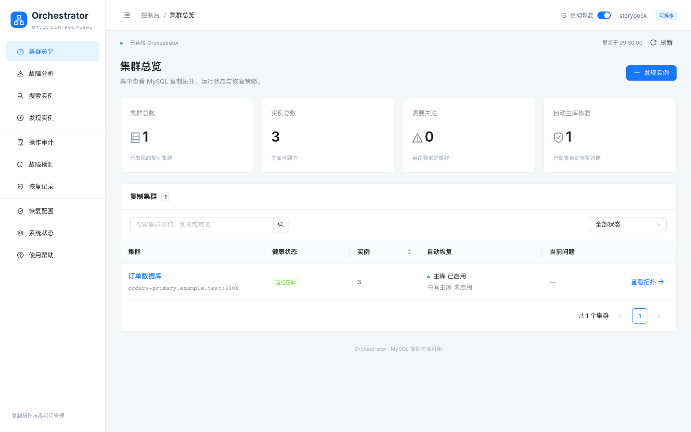
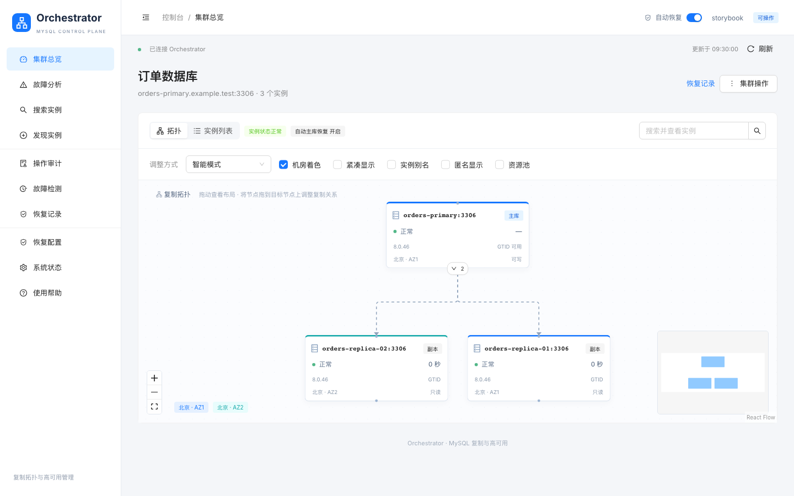
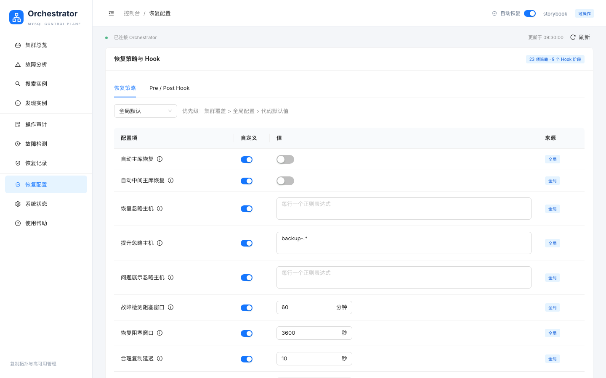

# orchestrator

[](https://github.com/SisyphusSQ/orchestrator/actions/workflows/main.yml)

[English documentation](README.md) · [GitHub Wiki](https://github.com/SisyphusSQ/orchestrator/wiki/ZH-Overview) · [Releases](https://github.com/SisyphusSQ/orchestrator/releases)

`orchestrator` 用于发现、展示、调整和恢复 MySQL 复制拓扑。这个持续维护的分支保留了经过验证的拓扑算法，并提供仅支持 Raft 的服务端、独立 HTTP 客户端、内嵌 Web 控制台以及当前的可观测性和安全契约。

## 这个分支有什么不同？

- 所有服务端节点都参与 Raft。开发环境需要显式 bootstrap 单节点集群；生产通常使用 3 或 5 个投票节点。
- 服务端使用 `orchestrator server` 启动。远程管理使用独立 Go 客户端 `orch`；不再提供历史上直连数据库的 CLI 和 Shell 客户端。
- 每个 Raft 节点使用独立的 MySQL 或 SQLite 元数据库。节点通过 Raft 协调，而不是共享元数据库。
- React、TypeScript 与 Ant Design 控制台通过 `go:embed` 编入服务端；部署后不依赖 Node.js 或外置前端目录。
- 每个节点都暴露健康检查与 Prometheus 指标，并可通过 OTLP HTTP 导出 OpenTelemetry traces。

## 控制台

以下截图由当前 Storybook fixture 通过 `make docs-screenshots` 生成，文档中的界面状态可以审查并重复生成。

### 集群总览



### 拓扑与恢复策略

| 拓扑详情 | 恢复配置 |
| --- | --- |
|  |  |

## 快速开始

环境要求：Go 1.27.0、Node.js 22.22.2 或更新版本、pnpm 10.33.2。构建其他 revision 时，应重新读取 `go.mod` 和 `web/package.json`。

```sh
make deps
make web-deps
make build
bin/orchestrator server --config /absolute/path/orchestrator.conf.yaml
```

服务端仅支持 Raft。新开发环境必须显式 bootstrap 首个节点；请按[快速开始指南](https://github.com/SisyphusSQ/orchestrator/wiki/ZH-Getting-Started)操作，不能把启动进程等同于创建集群。

只构建并使用远程客户端：

```sh
make cli
export ORCH_ENDPOINT="http://127.0.0.1:3000"
bin/orch clusters
bin/orch topology --cluster production
```

使用 `bin/orch help <command>` 查看当前二进制实际支持的参数。自动化应优先使用 `--output json`；客户端报告“结果未知”时，必须先回读再决定是否重试写操作。

## 文档与开发

- [快速开始](https://github.com/SisyphusSQ/orchestrator/wiki/ZH-Getting-Started)
- [配置](https://github.com/SisyphusSQ/orchestrator/wiki/ZH-Configuration)
- [Raft 运维](https://github.com/SisyphusSQ/orchestrator/wiki/ZH-Raft-Operations)
- [故障恢复](https://github.com/SisyphusSQ/orchestrator/wiki/ZH-Failure-Recovery)与[计划切换](https://github.com/SisyphusSQ/orchestrator/wiki/ZH-Planned-Switchover)
- [开发指南](https://github.com/SisyphusSQ/orchestrator/wiki/ZH-Development)与[包职责指南](https://github.com/SisyphusSQ/orchestrator/wiki/ZH-Package-Guide)
- [升级指南](https://github.com/SisyphusSQ/orchestrator/wiki/ZH-Upgrading)
- [仓库内文档源](docs/README.md)

常用开发验证入口：

```sh
make test-unit
make test-integration
make test-web
make test-storybook
make test-docs
```

构建、自动化测试、产物发布、部署和真实 MySQL/Raft 验收是不同证据面，交付时需要分别说明。

## 项目沿革与许可证

本仓库源自 [Percona 的 orchestrator 分支](https://github.com/percona/orchestrator)和 [Shlomi Noach](https://github.com/shlomi-noach) 创建的 [openark/orchestrator](https://github.com/openark/orchestrator)。历史署名保留在仓库历史和文档中。

`orchestrator` 使用 [Apache License 2.0](LICENSE)。问题与改进建议请提交到 [GitHub Issues](https://github.com/SisyphusSQ/orchestrator/issues)。
